Este repositorio contiene el proyecto final del curso de "Comandos GNU/Linux" conformado por tres actividades.

##  Actividad 1 

La actividad 1 consiste en la realización de un script en Bash llamado `proyecto_final.sh`, el cual procesa múltiples archivos `.CSV` con datos meteorológicos de estaciones meteorológicas ubicadas en los planteles de la Escuela Nacional Preparatoria. El objetivo es generar un archivo `resumen.csv` que contenga:

- Nombre de la estación
- Longitud
- Latitud
- Temperatura máxima del mes (Tmax)
- Precipitación máxima del mes (Pmax)
- Fecha (mes y año)


###  Script de bash utilizado

El script busca los archivos que contienen "ENP" en su nombre, extrae datos relevantes (coordenadas, temperatura, precipitación), calcula los valores máximos y los guarda en un archivo `resumen.csv`.

###  Nombre del script: `proyecto_final.sh`

```bash
# Resumen del funcionamiento del script
# 1. Busca archivos con ENP en el nombre
# 2. Extrae Latitud, Longitud
# 3. Calcula temperatura máxima (Tmax) y precipitación máxima (Pmax)
# 4. Guarda todos los datos en resumen.csv

#!/bin/bash

echo "Estación,Longitud,Latitud,Tmax,Pmax,Date" > resumen.csv

for archivo in *ENP*.CSV; do
    # Obtener nombre de estación y fecha desde el nombre del archivo
    base=$(basename "$archivo" .txt)
    estacion=$(echo "$base" |  grep -o 'ENP[0-9]\+')
    fecha=$(echo "$base" | cut -d'-' -f1-2)

    # Extraer latitud y longitud desde la cabecera
    lat_lon_line=$(grep "Lat" "$archivo")
    lat=$(echo "$lat_lon_line" | sed -n 's/.*Lat \([0-9.]*\) N.*/\1/p')
    lon=$(echo "$lat_lon_line" | sed -n 's/.*Lon \([0-9.]*\) W.*/\1/p')
    # Asegurarse de que longitud sea negativa
    lon="-${lon}"

    awk -F',' -v estacion="$estacion" -v lat="$lat" -v lon="$lon" -v fecha="$fecha" '
        BEGIN {
            Tmax = -999; Pmax = -999;
            datos = 0;
        }
        /Dosis_UV/ { datos = 1; next }
        datos && NF >= 9 {
            temp = $2 + 0
            prec = $9 + 0
            if (temp > Tmax) Tmax = temp
            if (prec > Pmax) Pmax = prec
        }
        END {
            printf "%s,%.6f,%.6f,%.1f,%.1f,%s\n", estacion, lon, lat, Tmax, Pmax, fecha
        }
    ' "$archivo" >> resumen.csv
done
```
---

## Actividad 2
La actividad 2 consiste en generar gráficas de la Ciudad de México donde se ubiquen los puntos de mayor temperatura y precipitación utizando el script graficar.py a partir del archivo resumen.csv.

### Script de Python utlizado
``` python
import pandas as pd
import geopandas as gpd
import matplotlib.pyplot as plt
from scipy.interpolate import griddata
import numpy as np
import warnings
warnings.filterwarnings('ignore')
import argparse

def grafica(file,varname):

    graf_conf={
        "Tmax":{"label":"Temperatura Máxima (°C)",
                "title":"Temperatura Máxima estaciones PEMBU ", 
                "file_out":"temp_max_"},
        "Pmax":{"label":"Precipitación máxima (mm)",
                "title":"Precipitación estaciones PEMBU ", 
                "file_out":"prec_max_"},        
    }

    df = pd.read_csv(file)
    
    dates=df['Date'].unique()

    for date in dates:        
        #Máximo y mínimo del dominio
        df_filtered = df[df['Date'] == date]
        df_filtered=df_filtered.reset_index(drop=True)
        lonmax = df_filtered.Longitud.max()
        lonmin = df_filtered.Longitud.min()
        latmax = df_filtered.Latitud.max()
        latmin = df_filtered.Latitud.min()


        #Definiendo resolución
        x = np.arange(lonmin,lonmax,0.01)
        y = np.arange(latmin,latmax,0.01)

        #Creando malla
        grid_x, grid_y = np.meshgrid(x,y)

        #Ubicación de los valores
        points = []
        for n in range(len(df_filtered)):
            p = np.array([df_filtered.Longitud[n],df_filtered.Latitud[n]])
            points.append(p)
        points = np.array(points)

        values = df_filtered[varname]

        #Interpolando valores a la nueva malla
        grid_t = griddata(points, values, (grid_x, grid_y), method='linear')
        ruta_shape = 'capas/dest20gw.shp'
        shpmex = gpd.read_file(ruta_shape, rows=slice(24,25))
        cdmx = shpmex.boundary
        #Creando figura
        plt.figure()
        ax = plt.gca()
        #Graficando límites de cdmx
        cdmx.plot(ax=ax)
        #Graficando estaciones
        ss = ax.contourf(grid_x, grid_y, grid_t, cmap='jet', )
        # Agregar la barra de color
        cbar = plt.colorbar(ss, ax=ax)
        cbar.set_label(graf_conf[varname]["label"])  # Etiqueta opcional
        #Graficando malla
        ax.scatter(grid_x, grid_y, s=0.3, c='gray', alpha=0.5)
        ax.set_title(graf_conf[varname]["title"] + date)
        print("Generando ... "+graf_conf[varname]["file_out"]+date+'.png')
        plt.savefig(graf_conf[varname]["file_out"]+date+'.png')
    


if __name__ == "__main__":
    parser = argparse.ArgumentParser(description="Descripción de tu script")
    parser.add_argument("--file", type=str, default="datos_estaciones.csv", help="Nombre de archivo csv")
    parser.add_argument("--variable", type=str, default="Tmax", help=" posibles valores Tmax ,Pmax")
    args = parser.parse_args()
    grafica(args.file,args.variable)
´´´

### Imágenes Resultantes

A continuación se muestran las gráficas generadas para cada mes del año 2022:

### Temperatura Máxima por Mes

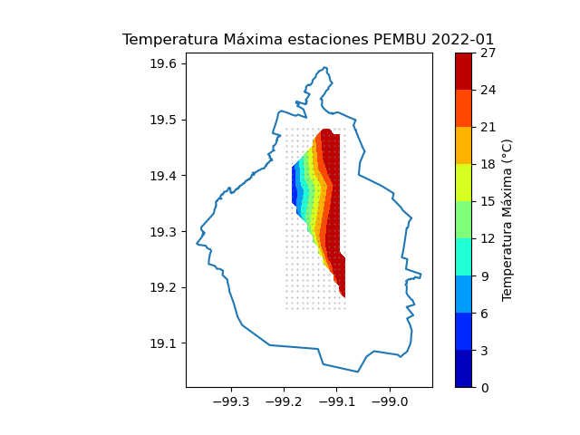  
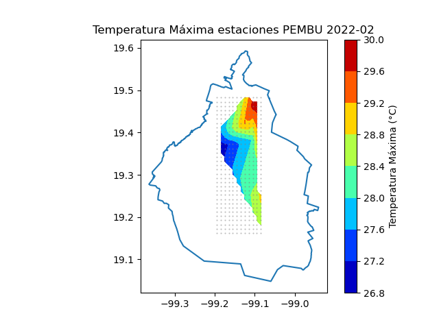  
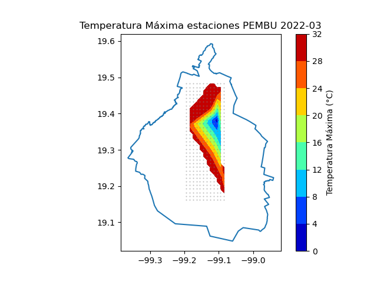  
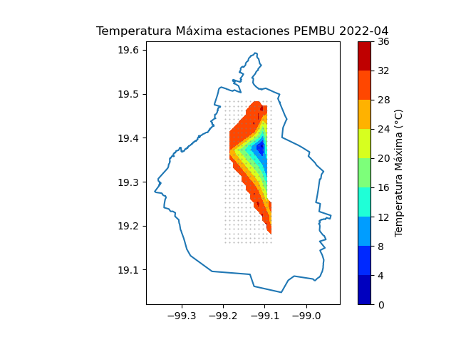  
  
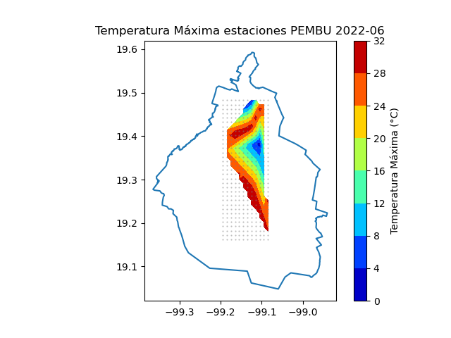  
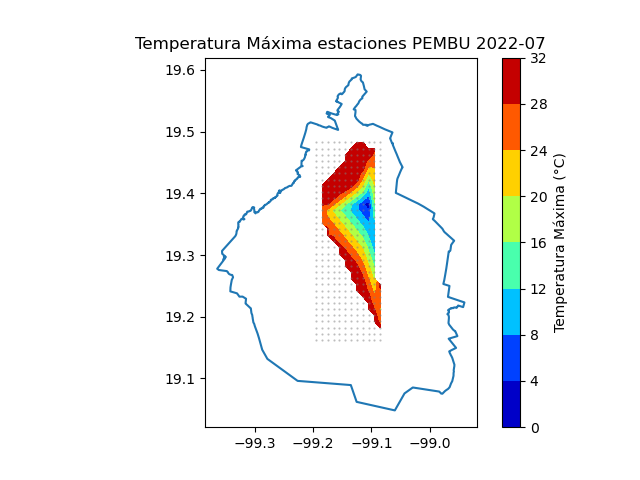  
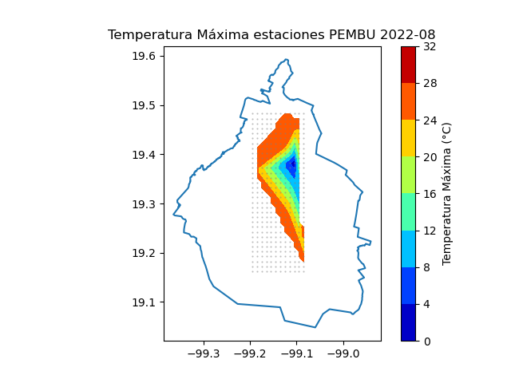  
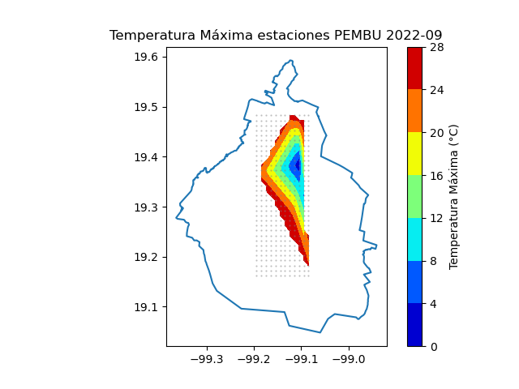  
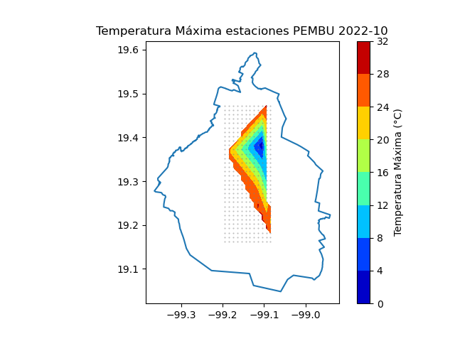  
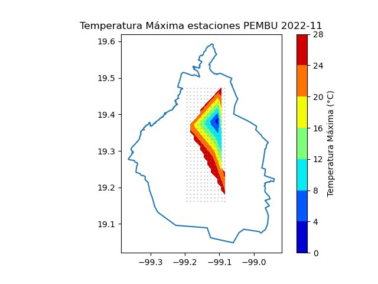  
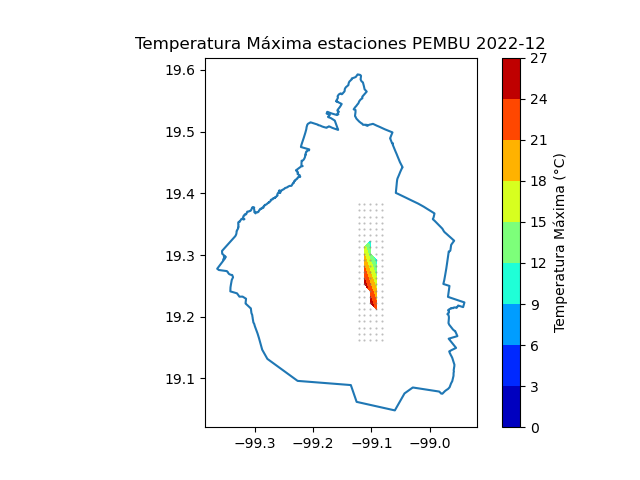  

---

###  Precipitación Máxima por Mes

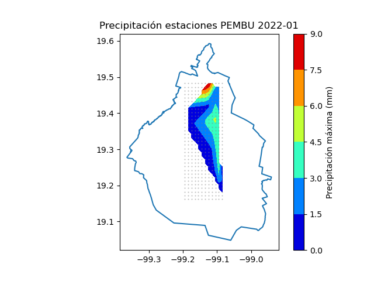  
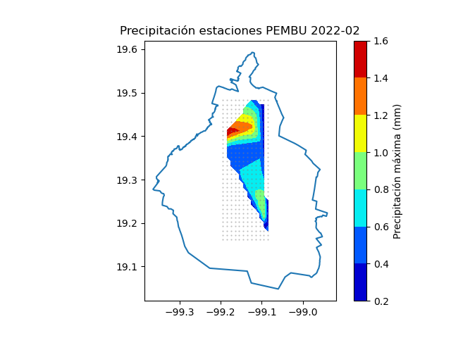  
  
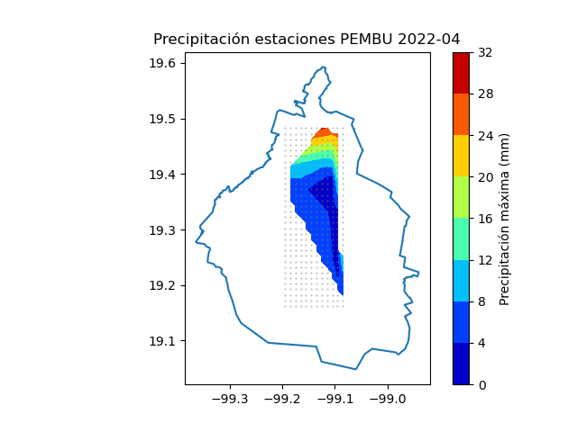  
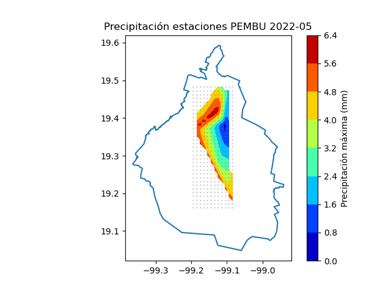  
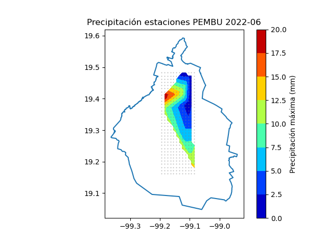  
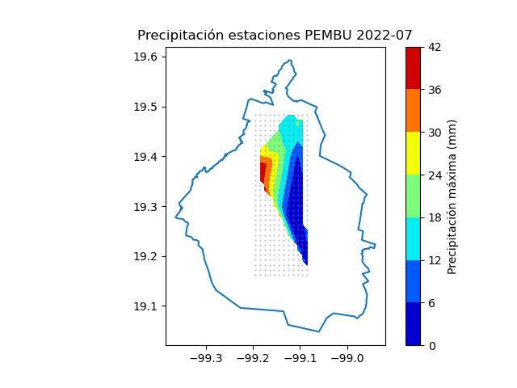  
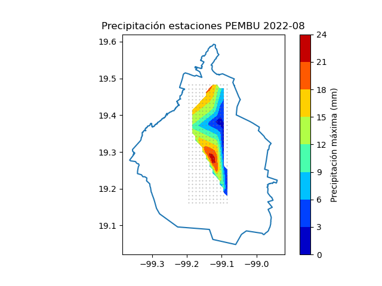  
  
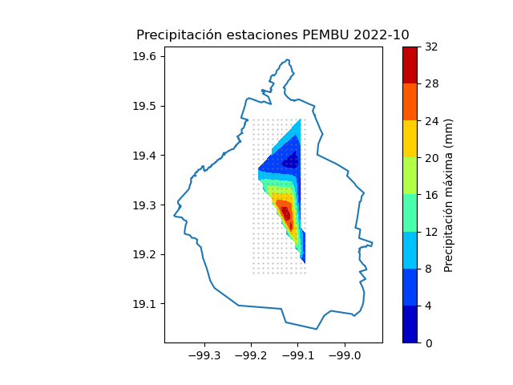  
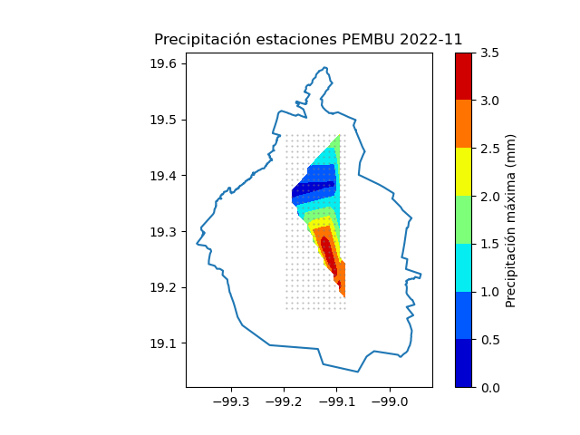  
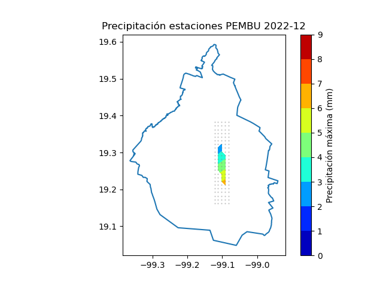  
